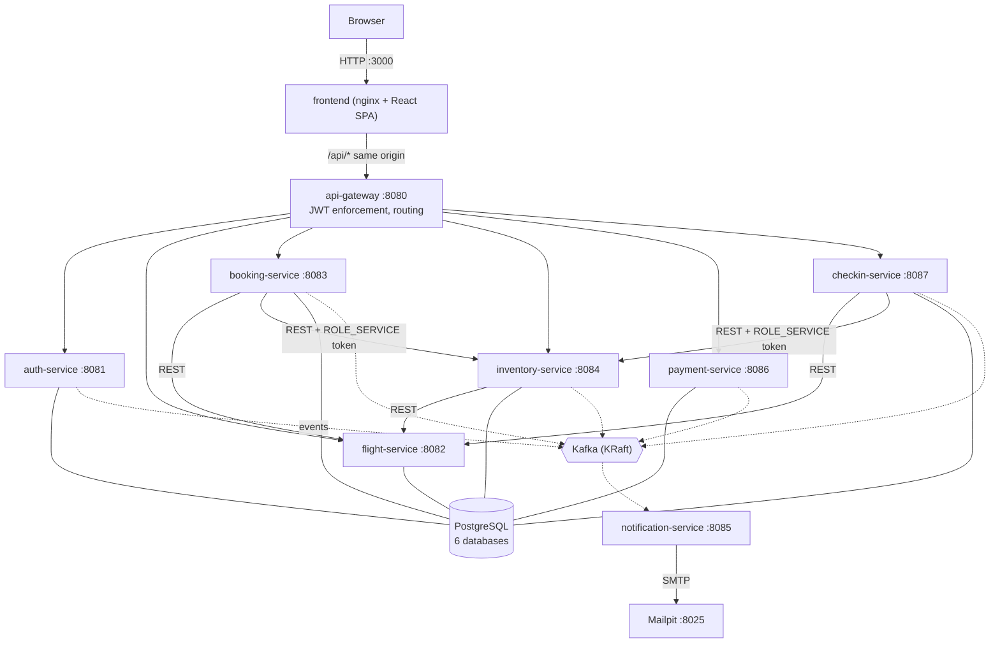
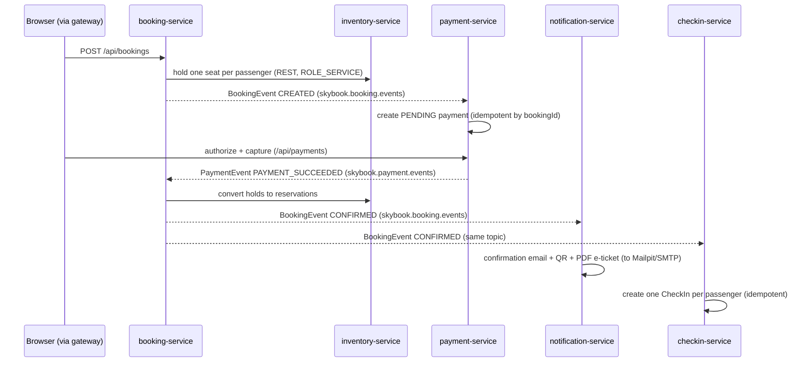

# Architecture Overview

This page is the entry point for anyone joining or reviewing SkyBook: it describes what the system is, which components exist and where they run, how a request and an event travel through the platform, how identity is enforced, and what the observability and deployment machinery looks like. It is a map, not a design document — each area links to the detailed module document in `docs/` that governs it.

## 1. System context

SkyBook is an airline reservations platform built as a microservice system: **8 Spring Boot applications (1 API gateway + 7 domain services)**, a **React/Vite/TypeScript single-page frontend**, **Apache Kafka** for business events, and **one PostgreSQL container hosting a separate database per service**. The whole stack runs under Docker Compose; GitHub Actions CI/CD promotes immutable images through a DEV → SIT → TEST/QA → PERF → UAT → STAGING → PROD ladder, with production on a single Oracle Cloud VM behind Caddy (automatic TLS).

A passenger can search flights without an account, price against a fare calendar, select seats from real cabin maps, pay, receive a confirmation email with a PDF e-ticket, check in inside the correct window, and carry a QR boarding pass that the gate-operations console verifies. Staff use an admin console for flight scheduling, fleet/seat-map management, inventory, gate operations, and booking search.

Platform baseline (from `backend/pom.xml` and `docker-compose.yml`): **Java 21, Spring Boot 3.5.16, Spring Cloud 2025.0.0, PostgreSQL 16 (alpine), Apache Kafka 3.9.0 (KRaft, single broker), React 19 + Vite + TypeScript + Tailwind 4 served by nginx**.

## 2. Component inventory

Only the frontend (3000), the API gateway (8080), Mailpit's UI (8025), and the observability UIs are published to the host. Every service also has an internal-only management port (`9081`–`9087`, `9080` for the gateway) carrying Spring Actuator; it is never published.

### Applications

| Component | Tech | Port | Database | Role |
|---|---|---|---|---|
| frontend | React 19 + Vite + TypeScript + Tailwind 4, nginx | 3000 (host) | — | SPA; nginx serves the built bundle and proxies `/api` to the gateway so the browser sees one origin |
| api-gateway | Spring Boot (Spring Cloud Gateway, server MVC) | 8080 (host) | — | Static routing table, JWT enforcement, cookie→Bearer credential translation, downstream error handling |
| auth-service | Spring Boot | 8081 | `skybook_auth` | Accounts, RS256 token issuance, OTP email verification, Google SSO, guest sessions, profile, saved travellers; sole holder of the JWT private key |
| flight-service | Spring Boot | 8082 | `skybook_flight` | Flights, schedules, routes, airports, fare calendar |
| booking-service | Spring Boot | 8083 | `skybook_booking` | Bookings, PNRs, passengers, segments, tickets/coupons, cancellation policy, the booking saga |
| inventory-service | Spring Boot | 8084 | `skybook_inventory` | Seat maps, seat holds and reservations, per-flight inventory (pessimistic-lock seat exclusivity) |
| notification-service | Spring Boot | 8085 | — | Kafka consumer only: email rendering (HTML + QR), PDF e-tickets and boarding passes |
| payment-service | Spring Boot | 8086 | `skybook_payment` | Payments (authorize → capture), refunds by fare rules, invoices |
| checkin-service | Spring Boot | 8087 | `skybook_checkin` | Check-in windows (departure-airport-local), boarding passes, baggage, flight manifests |

Two shared libraries (Maven modules, not deployables): **skybook-common** (event contracts, Kafka topic constants, error shape, airport timezones) and **skybook-security** (the single JWT validator, ownership rules, and the `ROLE_SERVICE` token client used fleet-wide). An **e2e-tests** module holds the end-to-end certification suite.

### Infrastructure (docker-compose.yml)

| Component | Image | Port | Role |
|---|---|---|---|
| postgres | postgres:16-alpine | 5432 (internal) | One instance, six databases created by `docker/postgres/init-databases.sql` (`skybook_auth/flight/booking/inventory/payment/checkin`) |
| kafka | apache/kafka:3.9.0 | 9092 (internal) | Single-broker KRaft cluster |
| mailpit | axllent/mailpit:v1.21.8 | 8025 (host UI), 1025 (internal SMTP) | Local mail sink; notification-service delivers here by default |
| prometheus | prom/prometheus:v3.2.1 | 9090 (host) | Metrics, scraping `/actuator/prometheus` |
| grafana | grafana/grafana:11.6.0 | 3001 (host) | Dashboards, Explore for logs and traces (3001 because 3000 is the frontend's) |
| loki | grafana/loki:3.4.2 | 3100 (host) | Log store |
| promtail | grafana/promtail:3.4.2 | — | Tails container JSON logs into Loki via Docker service discovery |
| tempo | grafana/tempo:2.7.1 | 3200 (host), 4317 (internal OTLP gRPC) | Trace store |
| otel-agent | curlimages/curl:8.12.1 (one-shot) | — | Downloads the pinned OpenTelemetry Java agent 2.14.0 into a shared volume every JVM mounts read-only |

## 3. Service topology

## 4. Request flow

1. The browser loads the SPA from nginx on port 3000 and calls `/api/*` on the **same origin**; nginx proxies to the gateway on 8080. Same-origin is what allows the session cookie to be `SameSite=Lax`.
2. The gateway (`GatewayRoutesConfig.java`) is a pure pass-through proxy — no path rewriting, no service discovery; downstream base URLs are static configuration. Auth endpoints are routed by **explicit path list**, never wildcard, so the internal-only `/api/auth/service-token` endpoint can never be reached from the public edge.
3. The gateway's JWT filter translates the browser credential (httpOnly `skybook_session` cookie) into a downstream Bearer token. It is the only place that translation happens.
4. Each service re-validates the RS256 token itself (shared validator in `skybook-security`) — no service trusts a header for identity.
5. Synchronous service-to-service questions travel over REST (Feign) with per-service `ROLE_SERVICE` tokens; facts that already happened are announced on Kafka.

Route prefixes owned per service (from the gateway routing table): `/api/auth/*` and `/api/profile/**` → auth; `/api/flights/**`, `/api/flight-schedules/**` → flight; `/api/bookings/**` → booking; `/api/reservations/**`, `/api/inventory/**`, `/api/aircraft/**` → inventory; `/api/payments/**`, `/api/refunds/**`, `/api/invoices/**` → payment; `/api/checkins/**`, `/api/boarding-passes/**`, `/api/baggage/**`, `/api/manifests/**` → check-in.

## 5. Event flow — Kafka topics and the booking saga

Topic names are constants in `skybook-common` (`KafkaTopics.java`):

| Topic | Producer | Consumers |
|---|---|---|
| `skybook.booking.events` | booking-service | payment-service, checkin-service, notification-service |
| `skybook.payment.events` | payment-service | booking-service |
| `skybook.checkin.events` | checkin-service | booking-service, notification-service |
| `skybook.email.events` | auth-service | notification-service |
| `skybook.inventory.events` | inventory-service | — (published as facts; no in-fleet consumer today) |
| `skybook.flight.events` | — | — (constant reserved in `skybook-common`; unused today) |

Booking is a **saga, not a transaction** — it spans three services, each stage commits before the next, and failures compensate (holds released, draft cancelled; unfinished drafts are swept after 15 minutes):

Event types carried on these topics (enums in `skybook-common`): booking `CREATED / CONFIRMED / CANCELLED / PARTIALLY_CANCELLED / EXPIRED / COMPLETED / FARE_ALERT`; payment `PAYMENT_SUCCEEDED / PAYMENT_FAILED / PAYMENT_CANCELLED / REFUND_COMPLETED / REFUND_FAILED`; check-in `PASSENGER_CHECKED_IN / BOARDING_PASS_GENERATED / PASSENGER_BOARDED / PASSENGER_NO_SHOW / PASSENGER_CHECKIN_CANCELLED`; email `REGISTRATION_SUCCESS / FORGOT_PASSWORD / EMAIL_VERIFICATION`.

Cancellation rides the same fabric: booking-service quotes the refund and carries the tier percentage and fare-line breakdown **on the `CANCELLED`/`PARTIALLY_CANCELLED` event**, and payment-service pays exactly that (redeliveries are deduplicated by a deterministic refund cause — see `docs/IDEMPOTENCY_MODULE.md`). checkin-service cascade-cancels the affected check-in records. `PAYMENT_FAILED` leaves the booking `CREATED`; seat holds expire via TTL.

## 6. Auth model summary

Detailed in `docs/SECURITY_HARDENING_MODULE.md` and `docs/SSO_MODULE.md`.

- **RS256 asymmetric signing.** auth-service is the only holder of the private key (`JWT_PRIVATE_KEY` appears in its environment alone); the gateway and every service verify with the public key. Default issuer `skybook-auth`, audience `skybook-api`.
- **Browser sessions are httpOnly cookies**, not tokens in JavaScript: `skybook_session` for accounts, `__Host-skybook_guest` for no-account guest check-in. The gateway translates the cookie into a downstream Bearer token; `logout` and `me` are server round-trips because JavaScript can neither clear nor read the cookie.
- **Roles**: `ROLE_USER`, `ROLE_ADMIN`, `ROLE_SERVICE` (validated centrally in `skybook-security`'s `JwtTokenValidator`). Admin is granted only by promoting a registered account at auth-service boot (`SKYBOOK_BOOTSTRAP_ADMIN_EMAIL`) — deliberately no admin-by-API.
- **Service-to-service calls carry `ROLE_SERVICE` tokens.** booking-, checkin-, and inventory-service each hold their own client secret and exchange it at auth-service's internal `/api/auth/service-token` endpoint (unroutable from the gateway) for a short-lived, audience-scoped token. There is no shared secret; payment-service has no client credential because it makes no outbound service calls.
- **Registration requires OTP email verification**: a 6-digit code (stored only as a SHA-256 hash, with TTL, attempt cap, and resend cooldown) is delivered via `skybook.email.events` → notification-service; the gateway exposes `/api/auth/verify-email` and `/api/auth/resend-verification`.
- **Sign in with Google** (OIDC) exchanges the external identity for a SkyBook token at the boundary; empty client credentials switch the feature off entirely.

## 7. Observability

Detailed in `docs/OBSERVABILITY_MODULE.md`. Every JVM runs under the OpenTelemetry Java agent 2.14.0 (pulled once by the `otel-agent` compose one-shot), exporting traces over OTLP gRPC to **Tempo** (:4317), with `traceparent` propagated across HTTP and Kafka hops. Services log JSON to stdout, which **Promtail** ships to **Loki**; every log line carries a `trace_id` that links into the Tempo waterfall. **Prometheus** scrapes each service's `/actuator/prometheus`. **Grafana** (host port 3001) fronts all three, with a fleet dashboard (request rate, error rate, p95, JVM heap, live error logs). Actuator lives on internal-only management ports; only the `/livez` and `/readyz` probe paths are re-exposed on the main port for Kubernetes.

## 8. Delivery and environments

Detailed in `docs/ENVIRONMENTS.md`, `docs/CI_CD_MODULE.md`, and `docs/DEPLOY_ORACLE.md`. GitHub Actions workflows: `ci.yml` (build, tests, SonarCloud gate, Trivy image scan, multi-arch push to GHCR), `frontend.yml`, `e2e.yml` (nightly certification), and `promote.yml` — the promotion ladder. The principle is **build once, promote many**: images are built and scanned once per commit, then the exact digests are walked through ephemeral **DEV** (health + smoke), **SIT** (cross-service probes including an event through Kafka into the mail sink), **TEST/QA** (full e2e certification), **PERF** (k6 thresholds), a human **UAT** gate with recorded acceptance evidence, a transient **STAGING** rehearsal on the production host, and a digest-pull **PROD** deploy that ends with a backup. Production is a single Oracle Cloud VM behind Caddy with automatic TLS; a weekly **DR drill** backs up a live stack, destroys the database volume, restores, and verifies row counts (`docs/DR_RUNBOOK.md`). Compose overlays per rung live at the repo root (`docker-compose.ladder/staging/prod/perf/e2e.yml`).
